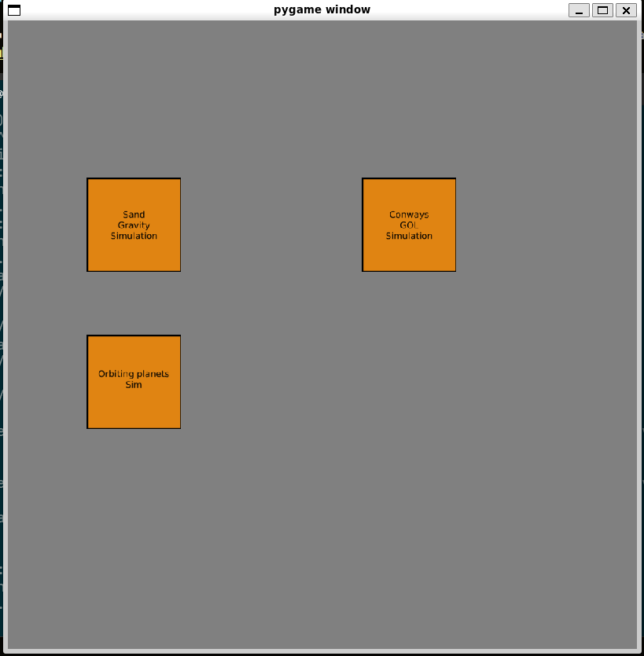
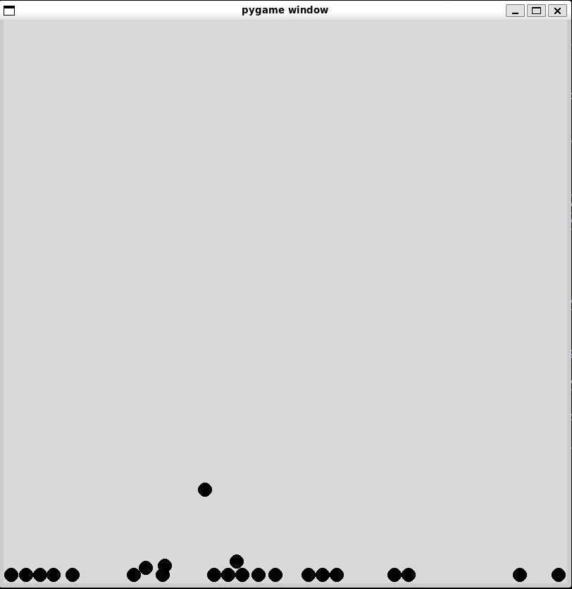
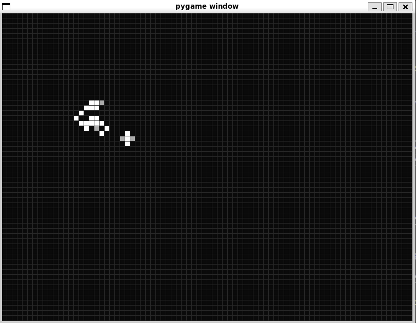
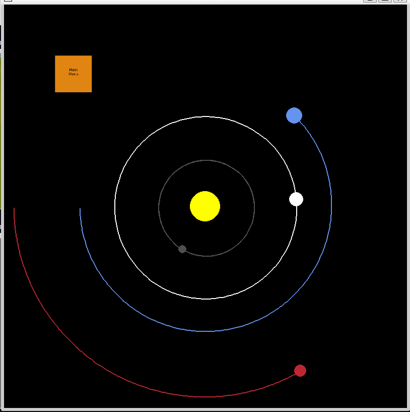

Hello this Mario V's phase 3 project which is a GUI that can display different simulations 

before running main.py install:

pygame
using 

> pip install pygame

pymunk
using

> pip install pymunk

GUI

Sims Currently Working: 

Falling sand
made using this tutorial 
https://www.youtube.com/watch?v=YrNpkuVIFdg
https://www.youtube.com/watch?v=G8MYGDf_9ho

Conways Game of Life
using: 
https://www.youtube.com/watch?v=cRWg2SWuXtM

Orbiting Planets
using:
https://www.youtube.com/watch?v=WTLPmUHTPqo

<!--  -->

Planned Sims:

TBA

Buttons were made using: 
https://www.geeksforgeeks.org/how-to-create-buttons-in-a-game-using-pygame/